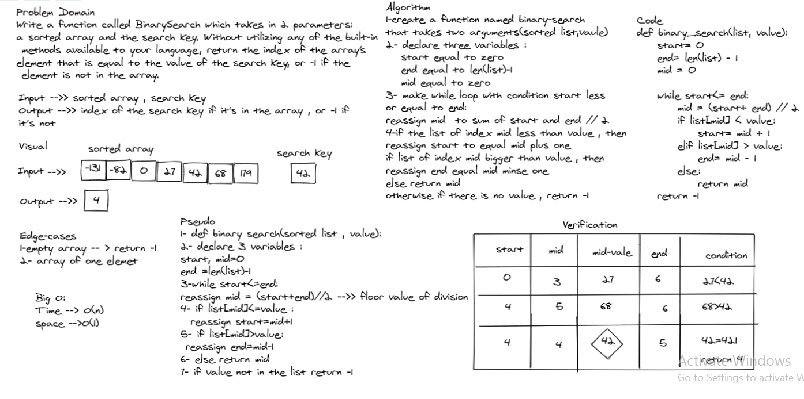

## Binary search in a sorted 1D array

---

*Author: Du'a Jaradat*

---

### Problem Domain
***[Insert to Middle of an Array]***

  Write a function called BinarySearch which takes in 2 parameters: a sorted array and the search key.

  Without utilizing any of the built-in methods available to your language, return the index of the array’s element that is equal to the value of the search key, or -1 if the element is not in the array.

---

### Inputs and Expected Outputs

| Input | Expected Output |
| :----------- | :----------- |
| [-131,-82,0,27,42,68,179] , 42 | 4|
| [1, 2, 3, 5, 6, 7], 4 | -1 |

---

### Big O

| Time | Space |
| :----------- | :----------- |
| O(n) | O(1) |

---

### Whiteboard Visual
***[array-binary-search algorithm]***
  

---

For more information on Markdown: https://www.markdownguide.org/cheat-sheet
