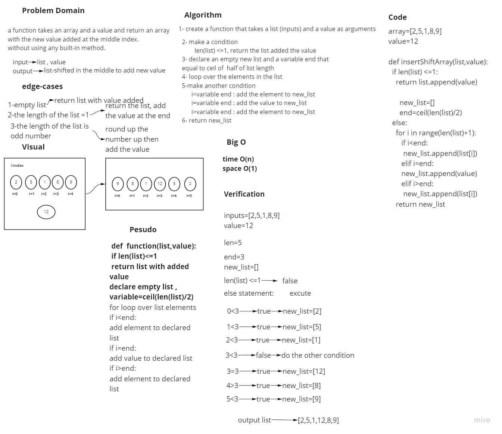

# Insert to Middle of an Array
  A function takes an array and a value and return an array with the new value added at the middle index.
  without using any built-in method.

## Whiteboard Process

## Approach & Efficiency
 Big O:
 time O(n)
 space O(1)
