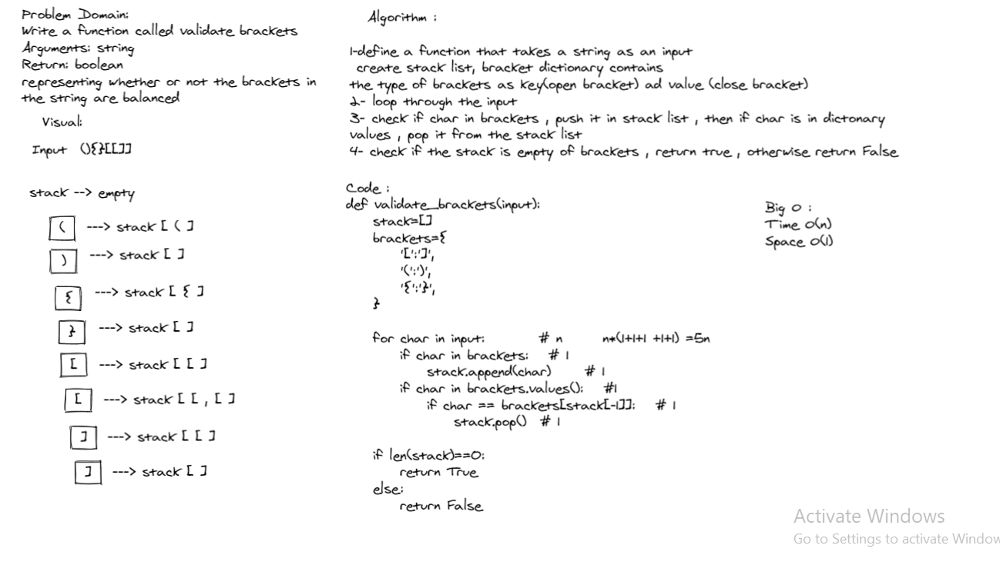

# Animal Shelter Queue

### Author : Du'a Jaradat

---

## Links

- [Pull Request](https://github.com/duajaradat/data-structures-and-algorithms/pull/37)
- [See The Code](brackets.py)
- [See The Tests](../tests/test_brackets.py)

---

## White Board Process

---

## Approach and Efficiency

---

### Feature Tasks

Write a function called validate brackets
Arguments: string
Return: boolean
representing whether or not the brackets in the string are balanced
There are 3 types of brackets:

Round Brackets : ()
Square Brackets : []
Curly Brackets : {}

---

### Big O:

Enqueue

- Time: O()
- Space: O()

Dequeue

- Time: O()
- Space: O()
