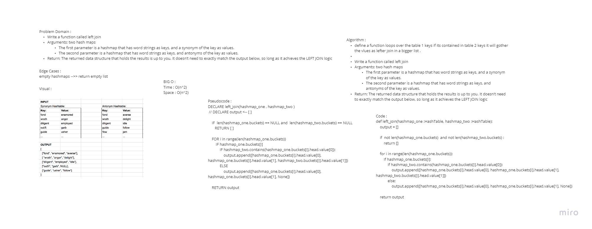

# Hashmap-Left-Join

## Author
*Du'a Jaradat*

## Collaboratores

*Haneen*
*Tasneem*
*Mona*

---

## Links
- [Pull Request](https://github.com/duajaradat/data-structures-and-algorithms/pull/48)

- [Code](https://github.com/duajaradat/data-structures-and-algorithms/blob/hashmap-left-join/python/code_challenges/hashmap_left_join/hashmap_left_join.py)

### Problem Domain

***Feature Tasks***

**- Breadth first Search**
- Write a function called left join
- Arguments: two hash maps
     - The first parameter is a hashmap that has word strings as keys, and a synonym of the key as values.
     - The second parameter is a hashmap that has word strings as keys, and antonyms of the key as values.
- Return: The returned data structure that holds the results is up to you. It doesn’t need to exactly match the output below, so long as it achieves the LEFT JOIN logic

**NOTES:**

- Combine the key and corresponding values (if they exist) into a new data structure according to LEFT JOIN logic.
- LEFT JOIN means all the values in the first hashmap are returned, and if values exist in the “right” hashmap, they are appended to the result row.
- If no values exist in the right hashmap, then some flavor of NULL should be appended to the result row.

---

### Structure and Testing

- Write at least three test assertions for each method that you define.

---

### Big O Analysis

|| Time | Space |
|:-----------| :----------- | :----------- |
|   | O(n2)      |  O(n2)         |
---

### Whiteboard Visual
***[LEFT JOIN]***

