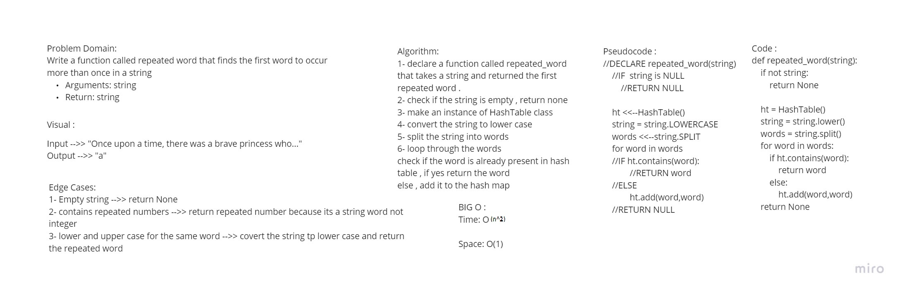

# HashTable Repeated Word

### Author : Du'a Jaradat

---

**Challenge Type:** Code Challenge / Algorithm

---
## Links

- [Pull Request](https://github.com/duajaradat/data-structures-and-algorithms/pull/46)
- [See The Code](repeated_word.py)
- [See The Tests](../tests/test_hashtable_repeated_word.py)

---

## White Board Process

---

### Feature Tasks

- Write a function called repeated word that finds the first word to occur more than once in a string.

         - Arguments: string
         - Return: string

---
### Structure and Testing

Write at least three test assertions for each method that you define.

### Stretch Goals

- Modify your function to return a count of each of the words in the provided string
- Modify your function to return a list of the words most frequently used in the provided string

### Big O:

- Time : O(n)

- Space : O(1)

