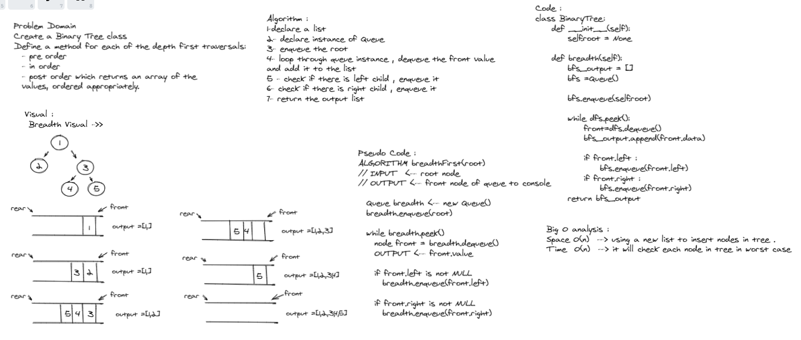

# Breadth-first Traversal

## Author
*Du'a Jaradat*

---

## Links
- [Pull Request](https://github.com/duajaradat/data-structures-and-algorithms/pull/40)

- [Code](https://github.com/duajaradat/data-structures-and-algorithms/blob/tree-breadth-first/python/code_challenges/tree_breadth/bfs.py)

### Problem Domain

***Feature Tasks***

**- Breadth first Search**
- Write a function called breadth first
     - Arguments: tree
     - Return: list of all values in the tree, in the order they were encountered
*NOTE: Traverse the input tree using a Breadth-first approach*

---

### Structure and Testing

- [x] “Happy Path” - Expected outcome
- [x] Edge Case (if applicable/obvious)

---

### Big O Analysis

|| Time | Space |
|:-----------| :----------- | :----------- |
|  BFS  | O(log n)      |  O(n)         |
---

### Whiteboard Visual
***[Binary Search Tree]***

