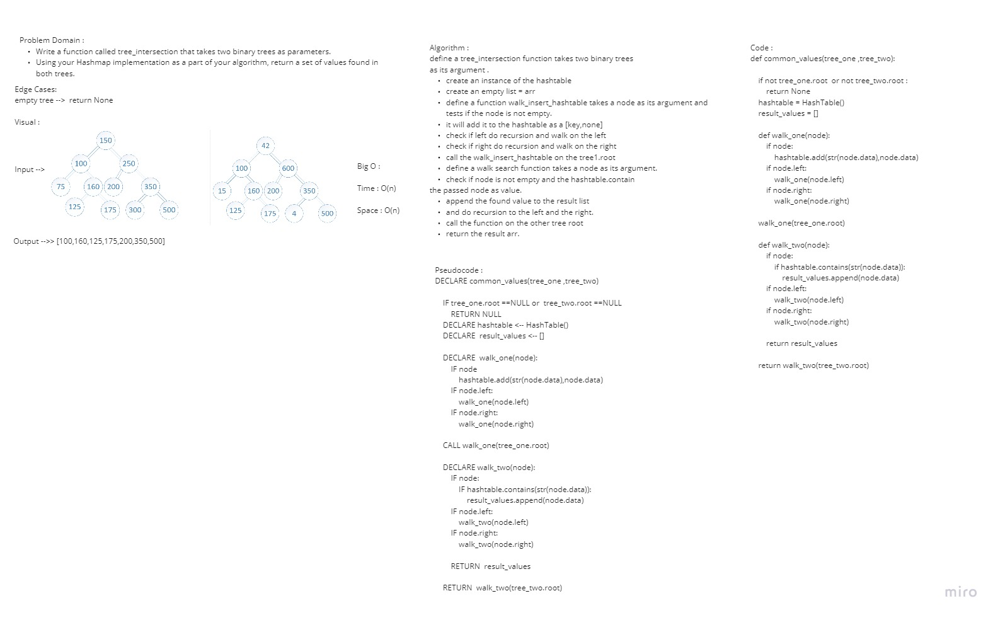

# Challenge : Find common values in 2 binary trees.

## Author
*Du'a Jaradat*

## Collaboratores :
*Tahany Ali*
*Haneen*
*Tasneem*
*Mona*
---

## Links
- [Pull Request](https://github.com/duajaradat/data-structures-and-algorithms/pull/47)

- [Code](https://github.com/duajaradat/data-structures-and-algorithms/blob/tree-intersection/python/tree_intersection/tree_intersection.py)

### Feature Tasks

- Write a function called tree_intersection that takes two binary trees as parameters.

- Using your Hashmap implementation as a part of your algorithm, return a set of values found in both trees.

### Structure and Testing

 - Write at least three test assertions for each method that you define.

---

### Big O Analysis

|| Time | Space |
|:-----------| :----------- | :----------- |
|| O(n) | O(n) |

---

### Whiteboard Visual
***[Tree Intersection]***

