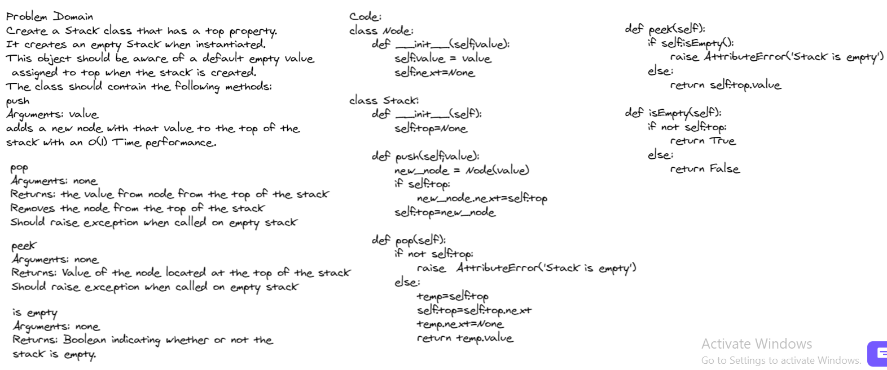
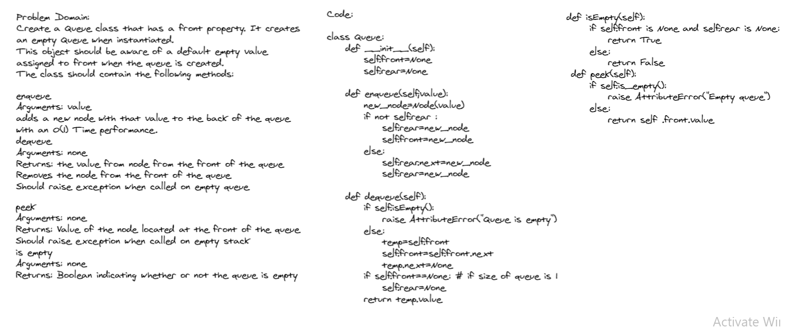

# Stacks and Queues.

*Author: Du'a Jaradat*

---

### Problem Domain
******
Using a Linked List as the underlying data storage mechanism, implement both a Stack and a Queue

---

### Whiteboard Visual

***[Stack]***

***[Queue]***

---

### Big O

| method| Time | Space |
|------ | :----------- | :----------- |
|Stacks  | O(1) |O(1) |
|Queues  | O(1) |O(1) |

---

### Feature Tasks

- [x] Can successfully push onto a stack
- [x] Can successfully push multiple values onto a stack
- [x] Can successfully pop off the stack
- [x] Can successfully empty a stack after multiple pops
- [x] Can successfully peek the next item on the stack
- [x] Calling pop or peek on empty stack raises exception
- [x] Can successfully instantiate an empty stack
- [x] Can successfully enqueue into a queue
- [x] Can successfully enqueue multiple values into a queue
- [x] Can successfully dequeue out of a queue the expected value
- [x] Can successfully peek into a queue, seeing the expected value
- [x] Can successfully empty a queue after multiple dequeues
- [x] Can successfully instantiate an empty queue
- [x] Calling dequeue or peek on empty queue raises exception
