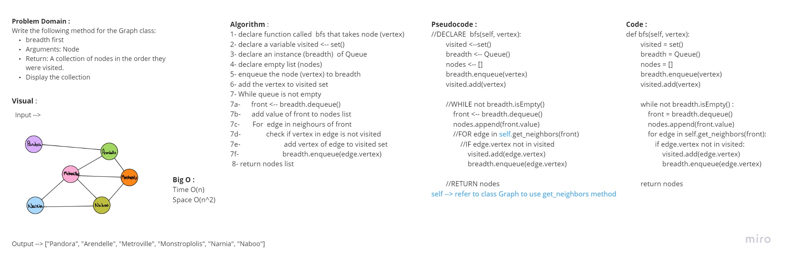

# Graph

## Author
*Du'a Jaradat*

---

## Links
- [Pull Request](https://github.com/duajaradat/data-structures-and-algorithms/pull/49)

- [Code](https://github.com/duajaradat/data-structures-and-algorithms/blob/graph/python/data_structure/graph/graph.py)

- [Pull Request for BFS ](https://github.com/duajaradat/data-structures-and-algorithms/pull/50)

- - [Pull Request for DFS ](https://github.com/duajaradat/data-structures-and-algorithms/pull/52)
---

### Problem Domain

Challenge Type: New Implementation

**Implementation**

Implement your own Graph. The graph should be represented as an adjacency list, and should include the following methods

- add node

     - Arguments: value
     - Returns: The added node
     - Add a node to the graph

- add edge
     - Arguments: 2 nodes to be connected by the edge, weight (optional)

     - Returns: nothing
     - Adds a new edge between two nodes in the graph
     - If specified, assign a weight to the edge
     - Both nodes should already be in the Graph

- get nodes
     - Arguments: none
     - Returns: Boolean, indicating if the key exists in the table already.

- get neighbors
     - Arguments: none
     - Returns a collection of edges connected to the given node

             - Include the weight of the connection in the returned collection

- size
     - Arguments: none
     - Returns the total number of nodes in the graph

---
### Structure and Testing

Write tests to prove the following functionality:

- [x] Node can be successfully added to the graph
- [x] An edge can be successfully added to the graph
- [x] A collection of all nodes can be properly retrieved from the graph
- [x] All appropriate neighbors can be retrieved from the graph
- [x] Neighbors are returned with the weight between nodes included
- [x] The proper size is returned, representing the number of nodes in the graph
- [x] A graph with only one node and edge can be properly returned
- [x] An empty graph properly returns null

---

###  Feature Tasks

Write the following method for the Graph class:

 - breadth first
 - Arguments: Node
 - Return: A collection of nodes in the order they were visited.
 - Display the collection

---

## Feature Tasks
Write the following method for the Graph class:

 - Name: Depth first
 - Arguments: Node (Starting point of search)
 - Return: A collection of nodes in their pre-order - depth-first traversal order
 - Program output: Display the collection

---

## White Board Process

---
### Big O Analysis

|| Time | Space |
|:-----------| :----------- | :----------- |
|add node| O(1) | O(n) |
|add edge| O(1) | O(n) |
|get nodes| O(n) | O(n) |
|get neighbors| O(n) | O(n) |

