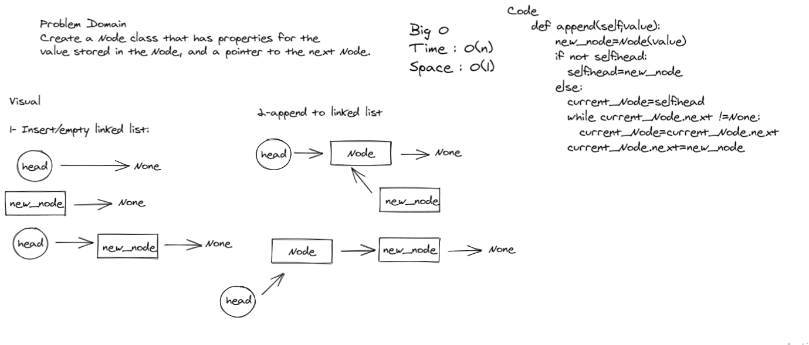
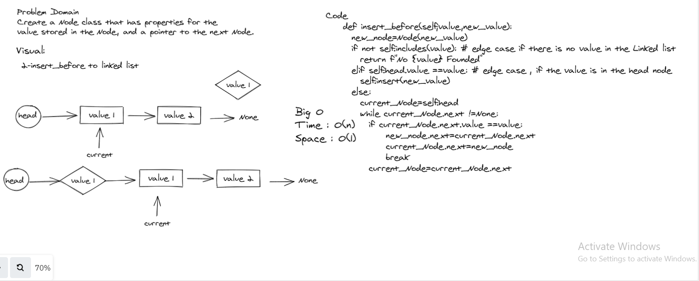
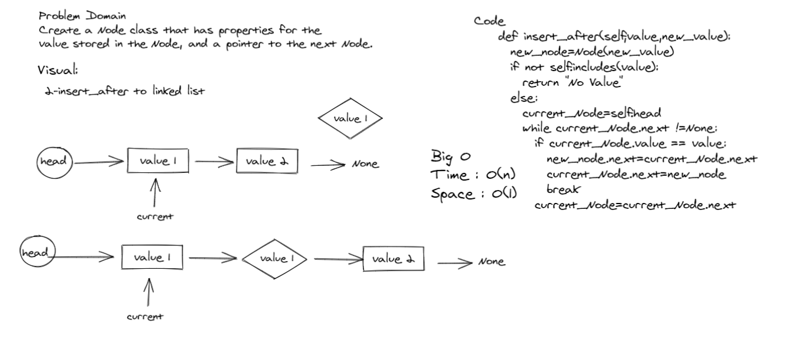

# Implementation: Extending an Implementation

*Author: Du'a Jaradat*

---

### Problem Domain
******
Write the following methods for the Linked List class:

- **append**

    arguments: new value
   adds a new node with the given value to the end of the list

- **insert before**

   arguments: value, new value
   adds a new node with the given new value immediately before the first node that has the value specified

- **insert after**

   arguments: value, new value
   adds a new node with the given new value immediately after the first node that has the value specified

---

### Whiteboard Visual
***[Append method]***

***[Insert before method]***

***[Insert after method]***

---

### Big O

| method| Time | Space |
|------ | :----------- | :----------- |
| insert_after | O(1) |O(1) |
| insert_before| O(1) |O(1) |
| append| O(n) |O(1) |
---

### Structure and Testing

- [x] Can successfully add a node to the end of the linked list
- [x] Can successfully add multiple nodes to the end of a linked list

- [x] Can successfully insert a node before a node located i the middle of a linked list

- [x] Can successfully insert a node before the first node of a linked list

- [x] Can successfully insert after a node in the middle of the linked list
- [x] Can successfully insert a node after the last node of the linked list
