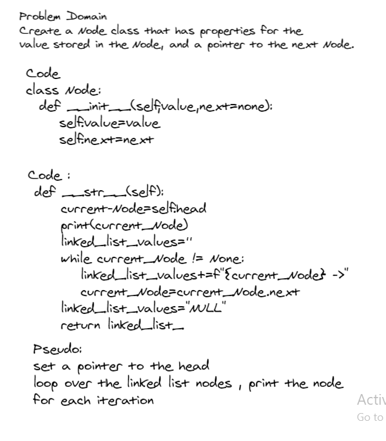
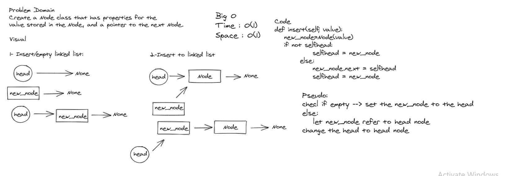
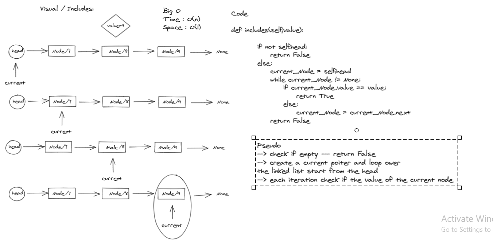

# Implementation: Singly Linked Lists

*Author: Du'a Jaradat*

---

### Problem Domain
******

Create a Node class that has properties for the
value stored in the Node, and a pointer to the next Node

---

### Whiteboard Visual
***[Insert method]***

***[class Node]***

***[Includes method]***

---

For more information on Markdown: https://www.markdownguide.org/cheat-sheet

---

### Big O

| method| Time | Space |
|------ | :----------- | :----------- |
| insert | O(1) |O(1) |
| includes | O(n) |O(1) |

---

### Structure and Testing

- [x] Can successfully instantiate an empty linked list
- [x] Can properly insert into the linked list
- [x] The head property will properly point to the first node in the linked list
- [x] Can properly insert multiple nodes into the linked list
- [x] Will return true when finding a value within the linked list that exists
- [x] Will return false when searching for a value in the linked list taht dose not exists
- [x] Can properly return a collection of all the values that exist in the linked list

