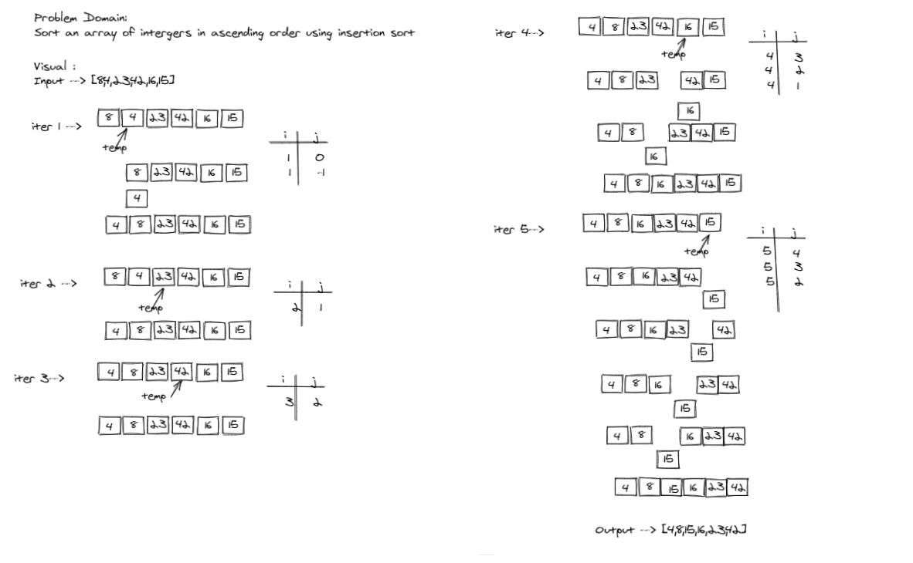
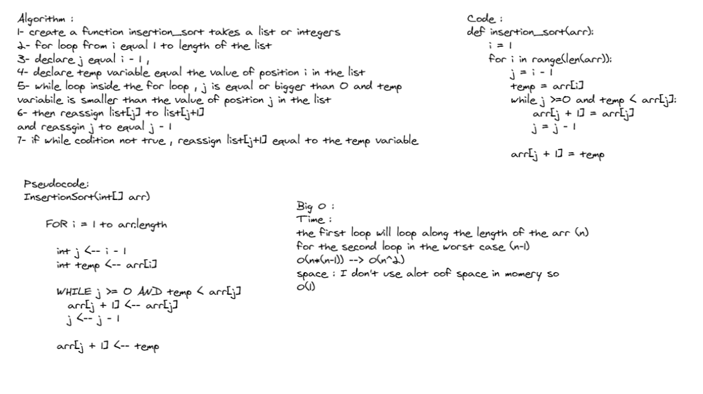

# Challenge Setup & Execution

## Author
*Du'a Jaradat*

---

## Links
- [Pull Request](https://github.com/duajaradat/data-structures-and-algorithms/pull/42)

- [Code](https://github.com/duajaradat/data-structures-and-algorithms/blob/insertion-sort/python/data_structure/sort/insertion/insertion_sort.py)

### Problem Domain

**Implementation**

- Provide a visual step through for each of the sample arrays based on the provided pseudo code

- Convert the pseudo-code into working code in your language

- Present a complete set of working tests

### Structure and Testing

- [x] “Happy Path” - Expected outcome
- [x] Expected failure
- [x] Edge Case (if applicable/obvious)


---

### Big O Analysis


|| Time | Space |
|:-----------| :----------- | :----------- |
|Insertion sort | O(n^2) | O(1) |

---

## Steps to  do Insertion Sort
for the example in the WhiteBoard :
```python
arr = [8,4,23,42,16,15]
```
Initially, an array of 6 integers, in order to implement the insertion sort, we shall take two variables, i and j,  j is the index of the first element whereas i is the index of second element.
```python
i = 1
j = i - 1 = 0
```
Making a temporary variable key to store the value of the ith element temporarily.
```python
arr[i] = 4
```
While j equal or bigger than 0 ,and temp is less than arr[j] , then place the value of the jth element at the index ‘j+1’.

```python
arr[j + 1] = arr [j] = 8
```
Now decrement ‘j’ by one, i.e j-1, if we do this, the jth index will become less than zero, so it will break the while loop .

```python
arr = [4,8,23,42,16,15]
```
Now, j
---

### Whiteboard Visual
***[Insertion Sort]***



