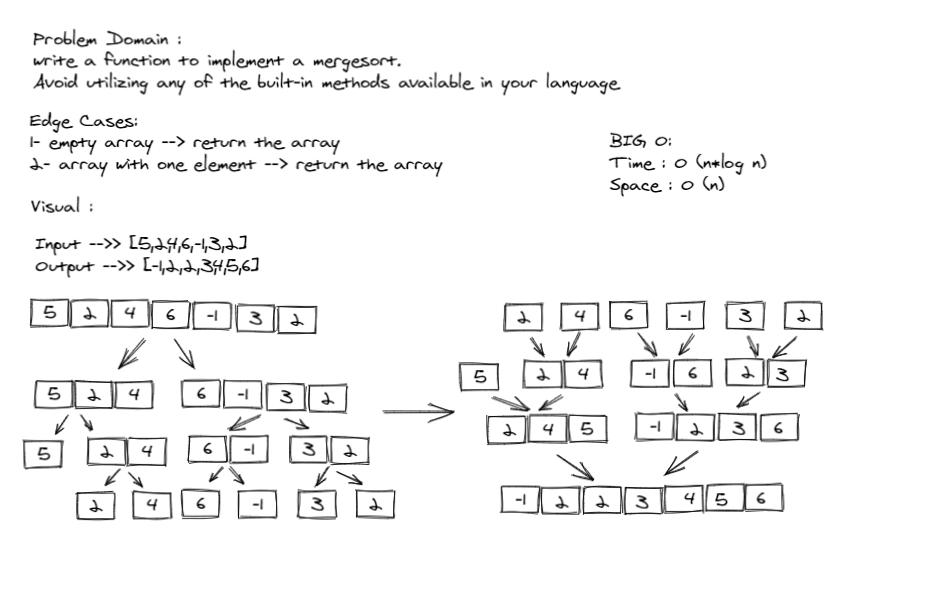

# Challenge Setup & Execution

## Author
*Du'a Jaradat*

---

## Links
- [Pull Request](https://github.com/duajaradat/data-structures-and-algorithms/pull/43)

- [Code](https://github.com/duajaradat/data-structures-and-algorithms/blob/merge-sort/python/data_structure/sort/merge/merge.py)

- [BLOG]()

### Problem Domain

**Implementation**

- Provide a visual step through for each of the sample arrays based on the provided pseudo code

- Convert the pseudo-code into working code in your language

- Present a complete set of working tests

### Structure and Testing

- [x] “Happy Path” - Expected outcome
- [x] Expected failure
- [x] Edge Case (if applicable/obvious)

---

### Big O Analysis

|| Time | Space |
|:-----------| :----------- | :----------- |
|Merge Sort | O(n*log (n)) | O(n) |

---

### Whiteboard Visual
***[Merge Sort]***

