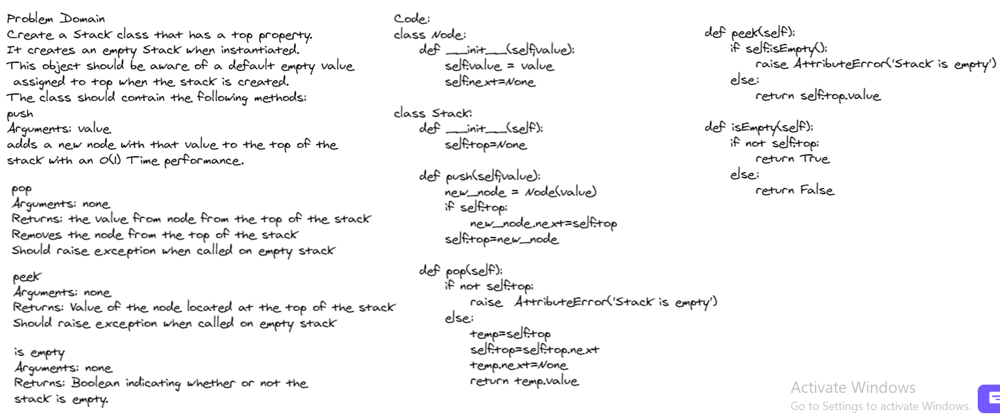
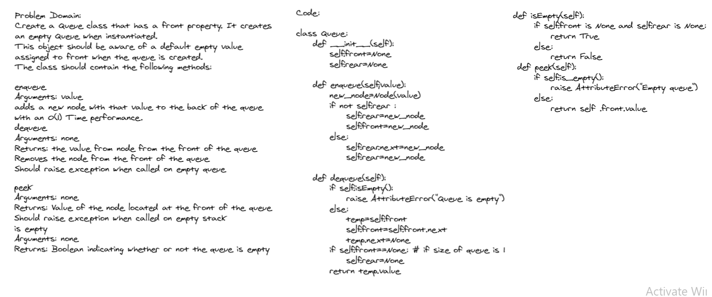

# Stacks and Queues.

*Author: Du'a Jaradat*

---

## Links
- [Pull Request](https://github.com/duajaradat/data-structures-and-algorithms/pull/34)

- [Code](https://github.com/duajaradat/data-structures-and-algorithms/blob/stack-queue-pseudo/python/data_structure/stacks_queues/stacks_queues.py)

---

### Problem Domain
******
Using a Linked List as the underlying data storage mechanism, implement both a Stack and a Queue

---

***Feature Tasks***

**Node**

 - Create a Node class that has properties for the value stored in the Node, and a pointer to the next node.

**Stack**

 - Create a Stack class that has a top property. It creates an empty Stack when instantiated.
     - This object should be aware of a default empty value assigned to top when the stack is created.
     - The class should contain the following methods:
     - push
         - Arguments: value
         - adds a new node with that value to the top of the stack with an O(1) Time performance.
     - pop
         - Arguments: none
         - Returns: the value from node from the top of the stack
         - Removes the node from the top of the stack
         - Should raise exception when called on empty stack
     - peek
         - Arguments: none
         - Returns: Value of the node located at the top of the stack
         - Should raise exception when called on empty stack
     - is empty
         - Arguments: none
         - Returns: Boolean indicating whether or not the stack is empty.
**Queue**
 - Create a Queue class that has a front property. It creates an empty Queue when instantiated.

     - This object should be aware of a default empty value assigned to front when the queue is created.
     - The class should contain the following methods:
     - enqueue
         - Arguments: value
         - adds a new node with that value to the back of the queue with an O(1) Time performance.
     - dequeue
         - Arguments: none
         - Returns: the value from node from the front of the queue
         - Removes the node from the front of the queue
         - Should raise exception when called on empty queue
     - peek
         - Arguments: none
         - Returns: Value of the node located at the front of the queue
         - Should raise exception when called on empty stack
     - is empty
         - Arguments: none
         - Returns: Boolean indicating whether or not the queue is empty

---

### Whiteboard Visual

***[Stack]***

***[Queue]***

---

### Big O

| method| Time | Space |
|------ | :----------- | :----------- |
|Stacks  | O(1) |O(1) |
|Queues  | O(1) |O(1) |

---

### Feature Tasks

- [x] Can successfully push onto a stack
- [x] Can successfully push multiple values onto a stack
- [x] Can successfully pop off the stack
- [x] Can successfully empty a stack after multiple pops
- [x] Can successfully peek the next item on the stack
- [x] Calling pop or peek on empty stack raises exception
- [x] Can successfully instantiate an empty stack
- [x] Can successfully enqueue into a queue
- [x] Can successfully enqueue multiple values into a queue
- [x] Can successfully dequeue out of a queue the expected value
- [x] Can successfully peek into a queue, seeing the expected value
- [x] Can successfully empty a queue after multiple dequeues
- [x] Can successfully instantiate an empty queue
- [x] Calling dequeue or peek on empty queue raises exception
