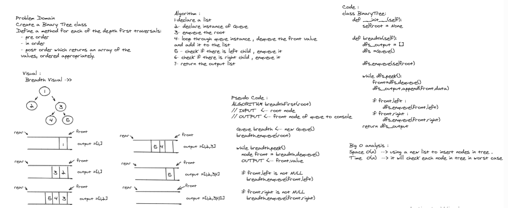
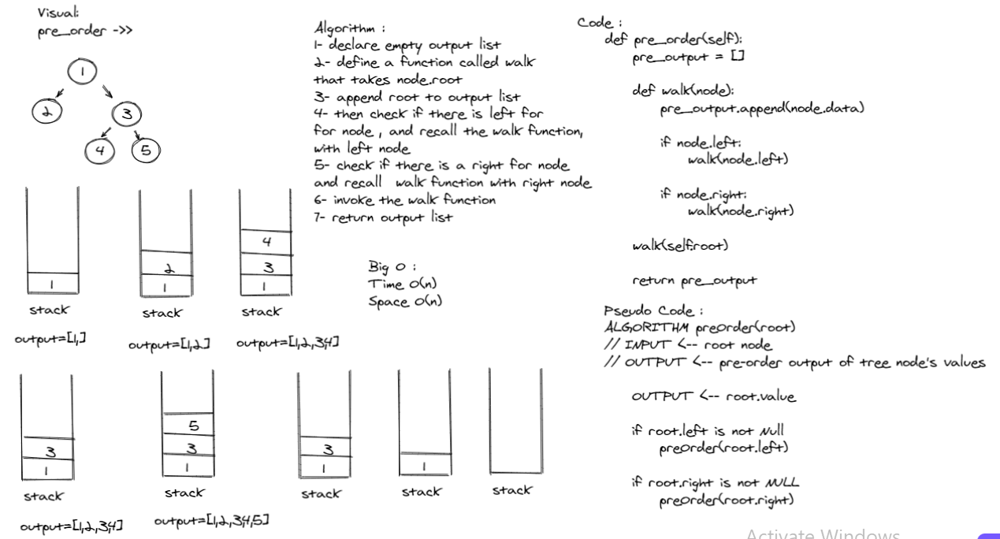
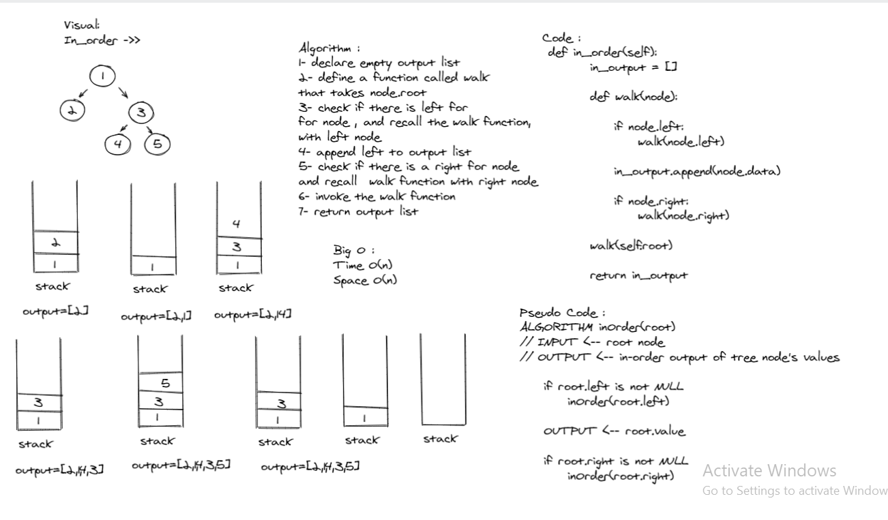
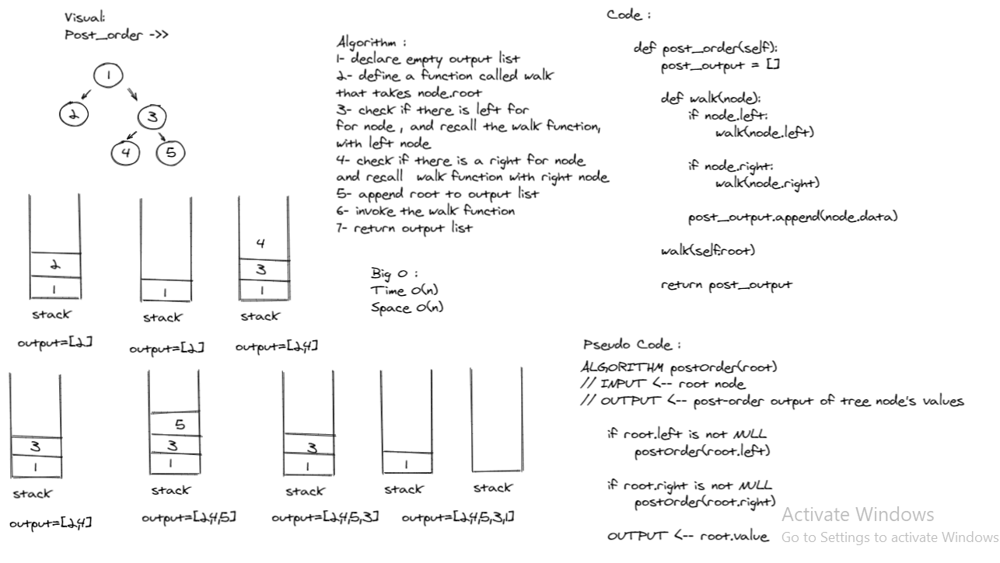
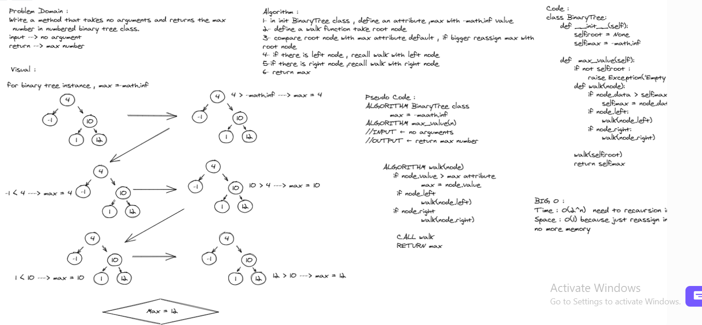

# Challenge Setup & Execution

## Author
*Du'a Jaradat*

---

## Links
- [Pull Request Binary Tree](https://github.com/duajaradat/data-structures-and-algorithms/pull/38)

- [Pull Request max_value method](https://github.com/duajaradat/data-structures-and-algorithms/pull/39)

- [Code](https://github.com/duajaradat/data-structures-and-algorithms/blob/trees/python/data_structure/trees/trees.py)

### Problem Domain

***Implementation Trees***

***Feature Tasks***

**- Node**
    - Create a Node class that has properties for the value stored in the node, the left child node, and the right child node.

- Create a Binary Tree class
     - Define a method for each of the depth first traversals:
         - pre order
         - in order
         - post order which returns an array of the values, ordered appropriately.

    - find maximum value
        - Arguments: none
        - Returns: number

- Any exceptions or errors that come from your code should be semantic, capture-able errors. For example, rather than a default error thrown by your language, your code should raise/throw a custom, semantic error that describes what went wrong in calling the methods .

**- Binary Search Tree**
- Create a Binary Search Tree class
     - This class should be a sub-class (or your languages equivalent) of the Binary Tree Class, with the following additional methods:
     - Add
         - Arguments: value
         - Return: nothing
         - Adds a new node with that value in the correct location in the binary search tree.
     - Contains
         - Argument: value
         - Returns: boolean indicating whether or not the value is in the tree at least once.

---

### Structure and Testing

- [x] Can successfully instantiate an empty tree
- [x] Can successfully instantiate a tree with a single root node
- [x] Can successfully add a left child and right child to a single root node
- [x] Can successfully return a collection from a preorder traversal
- [x] Can successfully return a collection from an inorder traversal
- [x] Can successfully return a collection from a postorder traversal

---

### Big O Analysis

|| Time | Space |
|:-----------| :----------- | :----------- |
|DFS| O(n) | O(n) |
|pre| O(n) | O(n) |
|in| O(n) | O(n) |
|max| O(2^n) | O(1) |
---

### Whiteboard Visual
***[Binary Search Tree]***

