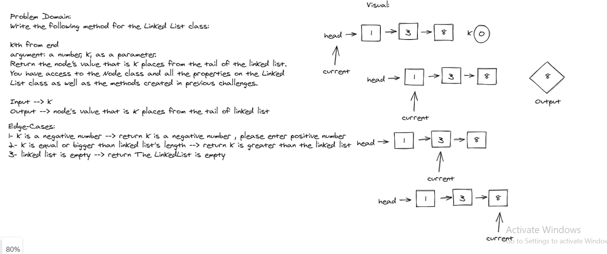
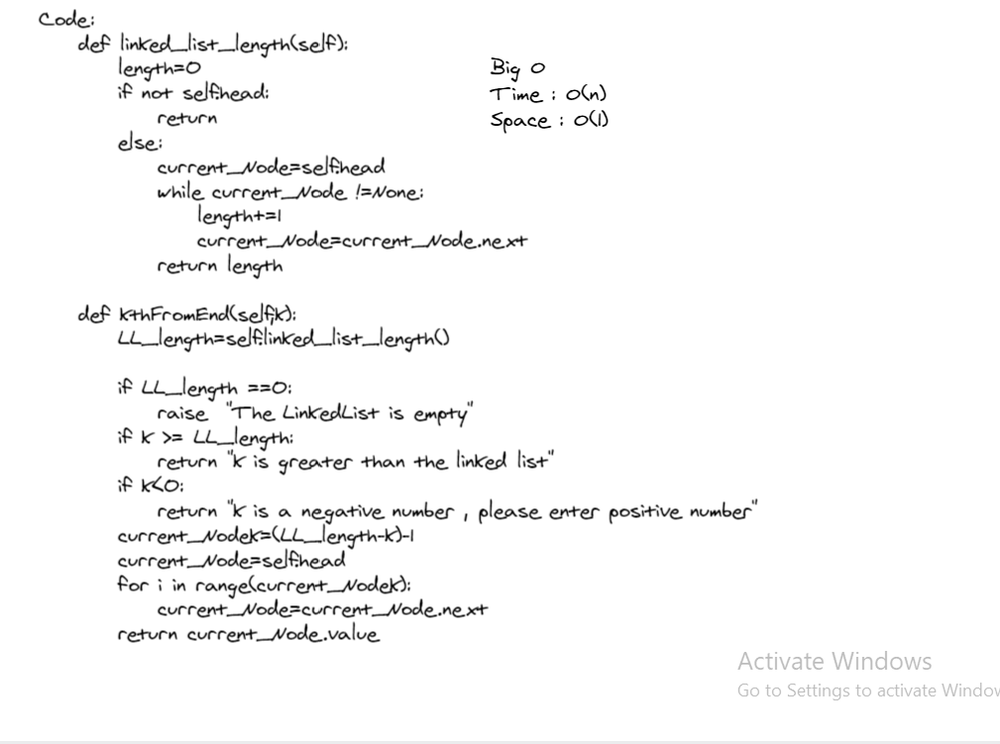

# Implementation: k-th value from the end of a linked list.

*Author: Du'a Jaradat*

---

### Problem Domain
******
Write the following methods for the Linked List class:

- **kth from end**

    argument: a number, k, as a parameter.

    Return the node’s value that is k places from the tail of the linked list.

---

### Whiteboard Visual
***[kth method]***

---

### Big O

| method| Time | Space |
|------ | :----------- | :----------- |
| kth | O(n) | O(1)|

---

### Structure and Testing

- [x] Where k is greater than the length of the linked list
- [x] Where k and the length of the list are the same

- [x] Where k is not a positive integer

- [x] Where the linked list is of a size 1

- [x] “Happy Path” where k is not at the end, but somewhere in the middle of the linked list

